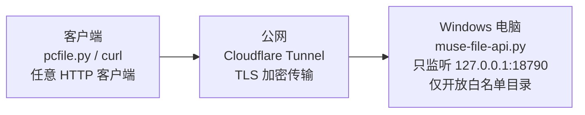

[English](README.md) | **简体中文**

# Muse File Bridge

**一句话：让 Muse 能直接读写你 Windows 电脑上指定文件夹里的文件。**

你说"帮我写个 Python 脚本放 Documents 里"，几秒钟后文件就出现在你电脑上了——不用再从聊天记录里复制粘贴代码。



为 Muse 而造：安装脚本、文档、[CONNECTOR-BRIEF.md](CONNECTOR-BRIEF.md)（给 Muse 的粘贴即用对接说明）都是按 Muse 在对面来写的。API 本身是普通 HTTPS + 令牌，任何 HTTP 客户端也都能用。

## 开始之前，你需要

- 一台 Windows 10/11 电脑，连着网
- 10 分钟时间
- 不需要管理员权限，不需要懂 Python

## 安装步骤

### 第 1 步：下载代码

点本页面右上角 **Code → Download ZIP**，下载后解压（放 D 盘、C 盘都行，记住位置）。

### 第 2 步：运行一键安装

打开解压出来的文件夹（能看到 `install.ps1` 的那一层），在空白处点右键，选"**在终端中打开**"（Win11；Win10 按住 **Shift + 右键**，选"**在此处打开 PowerShell 窗口**"），粘贴下面这行，回车：

```powershell
powershell -ExecutionPolicy Bypass -File .\install.ps1
```

> 如果右键菜单里没有终端选项：点开始菜单搜 `powershell` 打开它，再用 `cd` 进到解压的文件夹（进到能看见 `install.ps1` 的那一层），例如：
> ```powershell
> cd D:\muse-file-bridge-main\muse-file-bridge-main
> ```

安装脚本会自动安装 Python 和 cloudflared（通过 winget）。安装过程中会询问以下几项：

| 安装程序询问 | 建议选择 |
| ------------ | -------- |
| 允许 Muse 访问哪些目录？逗号分隔多个，直接回车用默认 | **直接回车**。默认为 `文档\MuseBridge`，脚本会自动创建该文件夹 |
| 允许 Muse 写入文件吗？第一次建议选否（只读模式）[y/N] | **首次输入 `n`**。只读模式最安全；如需写入功能，可后续再开启 |
| 隧道模式：[1] 命名隧道（长期稳定，需域名） [2] 临时隧道（快速试用） | **先体验请选择 `2`**。选项 1 需要自有域名（且 DNS 托管在 Cloudflare），适合长期使用 |

选择 `2`（临时隧道）：安装结束时会显示一个 `https://一串随机字符.trycloudflare.com` 格式的地址。**该地址每次重启电脑后都会变化**，仅适合初步体验。
选择 `1`（命名隧道）：安装过程中会弹出浏览器，请登录 Cloudflare 并授权，最后输入公网域名（例如 `bridge.你的域名.com`）。

出现"**全部完成！**"即表示安装成功。安装程序会注册两个开机自启动任务（`MuseFileBridge API` 和 `MuseFileBridge Tunnel`），无命令行窗口，在后台静默运行，异常退出后自动重启。

> **注意**：电脑进入睡眠或注销登录后，两个任务都会停止，Muse 就连不上了——这是最常见的"突然连不上"原因。睡眠时连不上是正常的，唤醒后自动恢复，不必专门把睡眠设为"从不"；但必须保持登录状态（锁屏可以，注销不行）。

### 第 3 步：将地址发给 Muse 并完成连接

把上一步得到的公网地址（`https://...` 那一整串）发给 Muse。

Muse 会发你一张**安全卡片**。你用记事本打开这个文件：

```
C:\Users\你的用户名\.muse-bridge\token
```

把里面那一长串令牌复制，填进安全卡片提交。**令牌相当于密码，只能填入安全卡片，请勿粘贴到聊天记录中**（卡片为加密直传，聊天记录不是）。

### 第 4 步：验证

先在本机确认服务活着（PowerShell 里运行）：

```powershell
$t = (Get-Content "$env:USERPROFILE\.muse-bridge\token" -Raw).Trim()
Invoke-RestMethod -Headers @{Authorization = "Bearer $t"} http://127.0.0.1:18790/api/health
```

看到 `ok : True` 说明服务端正常（如果改过端口，把 `18790` 换成你的端口）。再在浏览器打开你的公网地址：看到 `401`、提示未授权、或浏览器直接显示无法打开页面，都算隧道通了（只是没带令牌）；一直转圈超时，说明隧道没起来或电脑休眠了。

都没问题，再跟 Muse 说："列一下我 bridge 文件夹里有什么"。

如果第 2 步选择了只读模式（输入了 `n`），Muse 的写文件请求会被拒绝——这是预期行为，表示只读保护正在生效。如需启用写入：用记事本打开 `C:\Users\你的用户名\.muse-bridge\config.json`，把 `read_only` 改成 `false`，保存；然后点开始菜单搜 `taskschd.msc` 打开任务计划程序，找到 `MuseFileBridge API`，右键"重新启动"。

## 你能指望什么

- **Muse 只能访问你批准的文件夹。** 例如仅开放 `文档\MuseBridge` 时，桌面、下载目录及 D 盘其他位置均不可见、不可访问。`..` 穿越、绝对路径、符号链接逃逸都会被拦截。这是服务端的强制限制。
- **服务端只监听本机。** 它只绑定 `127.0.0.1`，除了经由你自己的隧道，局域网和公网都连不进来。
- **令牌相当于密码。** 仅保存在你电脑上的 token 文件中（文件权限仅限你本人），仅用于填入安全卡片。如需更换：执行 `python client/pcfile.py rotate-token`，旧令牌立即失效，新令牌仅写入你电脑上的文件。
- **默认只读。** 建议首次使用只读模式，确认 Muse 的行为符合预期后，再手动开启写入。
- **所有操作均有审计日志。** Muse 读取或写入的文件都会记录在 `C:\Users\你的用户名\.muse-bridge\audit.log` 中（每行一条），可随时查看。
- **写文件是原子操作。** 传输中途断掉也不会留下写一半的文件。
- **Muse 无法删除你的文件。** 服务端未提供删除接口。
- **支持干净卸载。** 详见下面的"卸载"章节。

## 卸载

1. 打开之前解压的文件夹（包含 `uninstall.ps1` 的那一层），在空白处点右键选"**在终端中打开**"（Win11；Win10 按住 **Shift + 右键** 选"**在此处打开 PowerShell 窗口**"），运行：

   ```powershell
   powershell -ExecutionPolicy Bypass -File .\uninstall.ps1
   ```

2. 脚本会先删除两个开机自启动任务（`MuseFileBridge API` 和 `MuseFileBridge Tunnel`），服务立即停止。
3. 随后脚本会询问：是否一并删除 `C:\Users\你的用户名\.muse-bridge`（包含配置、白名单和令牌）？
   - 输入 `y`：全部删除，不可恢复。之后重装将视为全新安装。
   - 直接回车（`n`）：保留配置和令牌。之后重跑 `install.ps1` 即可继续使用，无需重新配置。

**卸载不会删除以下内容：**

- 白名单文件夹本身（例如 `文档\MuseBridge` 中的文件）——卸载脚本不会触碰你的任何文件。
- Python 和 cloudflared——二者为通用工具，其他软件可能也在使用，不予删除。

**可选**：如果当初创建的是命名隧道，且希望将 Cloudflare 侧的隧道一并删除：

```powershell
cloudflared tunnel delete muse-bridge
```

（临时隧道停止后自动失效，无需处理。）

> 如果解压的文件夹已被删除，可手动操作：点开始菜单搜索 `taskschd.msc` 打开任务计划程序，在列表里找到 `MuseFileBridge API` 和 `MuseFileBridge Tunnel`，右键删除；再手动删掉 `C:\Users\你的用户名\.muse-bridge` 文件夹（如果想清配置的话）。

## 进阶

### 为什么不用 MCP？

MCP server 只能被 MCP client 调用。如果你的助手不会说 MCP（或者根本连不上你的电脑），这个普通的 HTTPS API 就是更务实的选择：任何能发 HTTPS + 带令牌的客户端都能用。

### 手动安装（不喜欢一键脚本的人）

```powershell
python server\muse-file-api.py
```

首次运行会生成访问令牌并打印出来——记下来，只显示这一次。同时会生成默认配置：**只开放一个空的 `文档\MuseBridge` 目录，而且是只读模式**——直接跑也安全。想开放更多，编辑 `%USERPROFILE%\.muse-bridge\config.json`：

```json
{
  "port": 18790,
  "read_only": false,
  "roots": {
    "projects": "D:\\Projects",
    "plugins": "D:\\MyPlugins"
  }
}
```

改完重启脚本生效。隧道手动搭建：

```powershell
cloudflared tunnel login
cloudflared tunnel create muse-bridge
cloudflared tunnel route dns muse-bridge bridge.你的域名.com
cloudflared tunnel run --url http://127.0.0.1:18790 muse-bridge
```

### 客户端（给助手 / 开发者用）

Windows PowerShell：

```powershell
$env:MUSE_BRIDGE_TOKEN="<第 3 步填进卡片的令牌>"
$env:MUSE_BRIDGE_URL="https://bridge.你的域名.com"

python client\pcfile.py health
python client\pcfile.py list projects
python client\pcfile.py read projects notes/todo.txt
python client\pcfile.py write projects notes/todo.txt ./todo.txt
python client\pcfile.py mkdir projects new-folder
python client\pcfile.py sync .\my-plugin plugins my-plugin   # 上传整个文件夹
```

Linux / macOS：

```bash
export MUSE_BRIDGE_TOKEN="<第 3 步填进卡片的令牌>"
export MUSE_BRIDGE_URL="https://bridge.你的域名.com"

python client/pcfile.py health
python client/pcfile.py list projects
python client/pcfile.py read projects notes/todo.txt
python client/pcfile.py write projects notes/todo.txt ./todo.txt
python client/pcfile.py mkdir projects new-folder
python client/pcfile.py sync ./my-plugin plugins my-plugin   # 上传整个文件夹
```

客户端拒绝明文 `http://` 地址——只有本地对着 `127.0.0.1` 测试时才加 `--allow-http`。

### API 说明

所有接口都需要在请求头带 `Authorization: Bearer <token>`。

| 方法 | 路径 | 说明 |
| ---- | ---- | ---- |
| GET | `/api/health` | 存活检查，返回开放的目录白名单和协议 `version` |
| GET | `/api/list?root=NAME&path=REL` | 列目录（最多 5000 条，超限截断并标记 `truncated: true`） |
| GET | `/api/read?root=NAME&path=REL` | 读文件（UTF-8 文本直接返回，二进制转 base64） |
| POST | `/api/write` | JSON `{root, path, content, encoding}` —— 写文件，自动创建父目录 |
| POST | `/api/mkdir` | JSON `{root, path}` —— 建目录 |
| POST | `/api/rotate-token` | 轮换令牌——旧令牌立即失效。新令牌只写进电脑上的 token 文件，**不会在响应里返回**（防止经聊天记录泄漏） |

限制：单次读取 2 MB，单次写入 10 MB，每分钟约 1000 次请求（**整条隧道共享**——服务端看到的隧道请求全是 `127.0.0.1`，超了返回 `429`）。只读模式下 `write`/`mkdir` 返回 `403`。特意没有提供删除接口。

如需让 Muse 对接该 API，将 [CONNECTOR-BRIEF.md](CONNECTOR-BRIEF.md) 全文粘贴给它即可。

### 常见问题

| 现象 | 怎么办 |
| ---- | ------ |
| 安装脚本报 ParserError / 中文乱码 | 下载的 ZIP 为旧版本。请重新下载最新版（脚本编码问题已修复） |
| `401 unauthorized` | 客户端用的令牌和电脑上 `%USERPROFILE%\.muse-bridge\token` 对不上。重新复制一次（别贴进聊天，用助手的安全卡片流程） |
| 客户端连不上服务端 | 先确认电脑没休眠、用户没注销（最常见原因）。再去任务计划程序看 `MuseFileBridge API` / `MuseFileBridge Tunnel` 的"上次运行结果"，以及 `%USERPROFILE%\.muse-bridge\server.log` 日志 |
| 隧道地址变了 | 用的是临时隧道，重启后地址会变；把新地址发给助手更新。长期用请重跑安装选命名隧道 |
| 端口被占用 | 改 `%USERPROFILE%\.muse-bridge\config.json` 里的 `port`，重启 `MuseFileBridge API` 任务（隧道命令里是同一个端口） |
| 想换令牌 | `python client/pcfile.py rotate-token`（需先设好令牌和地址）。旧令牌立即失效；新令牌只写在电脑 `%USERPROFILE%\.muse-bridge\token` 里，API 不返回、终端不打印，自己去文件里抄 |
| 写操作被拒绝（`403`） | 服务端在只读模式。把 `%USERPROFILE%\.muse-bridge\config.json` 里的 `read_only` 改成 `false`，重启 `MuseFileBridge API` 任务 |
| 助手到底动了哪些文件？ | 看 `%USERPROFILE%\.muse-bridge\audit.log`，每行一个 JSON |
| `tunnel route dns` 失败 | 该域名的 DNS zone 必须在你登录的那个 Cloudflare 账号下 |

## 项目结构

```
install.ps1               一键安装:检查 Python(缺失自动装)、装 cloudflared、生成令牌、
                          建配置、命名或临时隧道、注册自启动任务 (Windows)
uninstall.ps1             删除自启动任务 (Windows)
CONNECTOR-BRIEF.md        给 AI 助手看的对接说明(可直接粘贴)
server/muse-file-api.py   Windows 文件 API 服务端（仅用 Python 标准库）
client/pcfile.py          独立客户端（仅用 Python 标准库）
tests/smoke_test.py       端到端冒烟测试（仅用 Python 标准库）
CHANGELOG.md              版本更新记录
```

## 许可证

MIT — 见 [LICENSE](LICENSE)。
